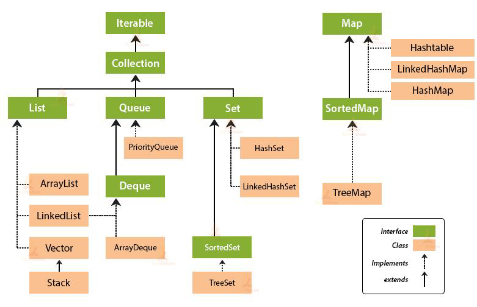

## Agenda
* Overview, Before Collections
* Iterator
* Collections


## Overview
Before Collections made its most welcome debut, the standard methods for grouping Java objects were via the **arrays**, the **Vector**, and the **Hashtable**

All three of these collections have different methods and syntax for accessing members: 

* **arrays** use the square bracket ([]) symbols
* **Vector** uses the elementAt method
* **Hashtable** uses get and put methods. 

These differences have long led programmers down the path to inconsistency in implementing their own collections -- some emulate the Vector access methods and some emulate the Enumeration interface.

To further complicate matters, most of the Vector methods are marked as final; that is, you cannot extend the Vector class to implement a similar sort of collection. We could create a collection class that looked like a Vector and acted like a Vector, but it couldn't be passed to a method that takes a Vector as a parameter.

Finally, none of the collections (array, Vector or Hashtable) implements a standard member access interface and had no common interface.

##Java Collections Framework
JDK 1.2 introduced a new framework for collections of objects, called the **Java Collections Framework**, offers developers a common way to implement and access collections.

The Collections framework will benefit your programming in many ways:
* **Reduces programming effort.** A lgorithms and data structures are already implemented, developer can focus on
other important parts of application.

* **Increases program speed and quality.** Programmer does not need to think of the best implementation of a
specific data structure. Programmer can simply use the best implementation to drastically boost the performance
of algorithm/program.

* **Consistent API.**

* **Reduces effort to design new APIs.** You don't have to reinvent the wheel each time are
creating an API that relies on collections; instead, just use standard collection
interfaces.

* **Fosters software reuse.** Collections interfaces and implementations are flexible
enough to be reused given that there is a c ontract of interface.

##Revision
* **Class** - A class is a user
  defined blueprint or prototype from which objects are created. It represents
  the set of properties or methods that are common to all objects of one type.
  Like
* **Interface** - Like a class, an interface can have methods and variables, but the methods declared in an
  interface are by default abstract ( only method signature, no body ). Interfaces specify what a
  class must do and not how. It is the blueprint of the class.
```
public interface MyInterface {
    //don’t need to implement, since java 8
    default void newMethod() {
        System.out.println("Newly added default method");
    }

    //don’t need to implement + we cannot override it
    static void anotherNewMethod() {
        System.out.println("Newly added static");
    }

    //must be implemented
    void existingMethod(String str);
}
```

##Hierarchy


##Iterable interface
Each collection now returns an Iterator, an improved type of Enumeration that allows element operations such as insertion and deletion. The Iterator is "fail-fast," which means you get an exception if the list you're iterating is changed by another user.

**Iterable** interface is the root interface for all the collection classes

Method | Second Description
------------ | -------------
**Iterator T > iterator()** | Returns the iterator

**Iterator** interface provides the facility of iterating the elements in a forward direction only

Method | Second Description
------------ | -------------
**boolean hasNext()** | Returns true if the iterator has more elements otherwise it returns false
**Object next()** | Returns the element and moves the cursor pointer to the next element. (throws NoSuchElementException)
**void remove()** | Removes the last elements returned by the iterator

```
MORE CODE EXAMPLE

```


##Collection interface
The **Collection** interface represents a group of objects (elements)

The **Collection** interface is implemented by all the classes in the collection framework

Method | Second Description
------------ | -------------
**int size()** | Returns the number of elements in this collection
**boolean isEmpty()** | TRUE - contains no elements, FALSE - contains
**boolean contains Object o)** | TRUE - contains the specified element, FALSE - no
**boolean containsAll (Collection<?>)** | TRUE - contains ***all*** of the elements
**boolean add E e)** | Inserts an element to collection
**boolean addAll (Collection<? extends E>)** | Insert the specified collection elements
**boolean remove(Object element)** | Removes the given objection
**boolean removeAll (Collection<?>)** | Removes all given objects
**boolean retainAll (Collection<?>)** | Retains only given objects


###Collections
```
MORE CODE EXAMPLEs
```
##Materials

Java , Head First book

Thinking in Java, Eckel book

https://docs.oracle.com/javase/tutorial/collections/interfaces/index.html

https://www.javatpoint.com/collections-in-java

https://www.geeksforgeeks.org/collections-class-in-java